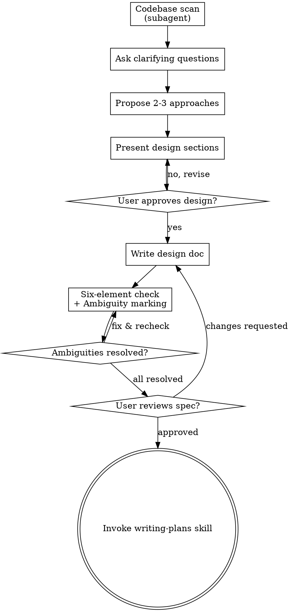

## Dev-flow 上下文

| 项目 | 值 |
|------|---|
| 所在阶段 | Stage 1 需求讨论（前半段） |
| 触发方式 | 由主 agent 直接执行（交互阶段，需多轮用户对话） |
| 上游 | 用户提出需求 |
| 下游（完成后进入） | xyz-harness-writing-plans（Stage 1 后半段，紧接执行） |
| 回退目标 | 无前置阶段。如设计需修改，在本阶段内直接迭代 |

# Brainstorming Ideas Into Designs

Help turn ideas into fully formed designs and specs through natural collaborative dialogue.

Start by understanding the current project context, then ask questions one at a time to refine the idea. Once you understand what you're building, present the design and get user approval.

<HARD-GATE>
Do NOT invoke any implementation skill, write any code, scaffold any project, or take any implementation action until you have presented a design and the user has approved it. This applies to EVERY project regardless of perceived simplicity.
</HARD-GATE>

## Anti-Pattern: "This Is Too Simple To Need A Design"

Every project goes through this process. A todo list, a single-function utility, a config change — all of them. "Simple" projects are where unexamined assumptions cause the most wasted work. The design can be short (a few sentences for truly simple projects), but you MUST present it and get approval.

## Checklist

You MUST create a task for each of these items and complete them in order:

1. **Scan codebase** — dispatch read-only subagent to explore project structure, existing APIs, types, and patterns. Output: `infrastructure-scan.md` (see below)
2. **Ask clarifying questions** — one at a time, understand purpose/constraints/success criteria. Use scan results to ask higher-quality questions
3. **Propose 2-3 approaches** — with trade-offs and your recommendation
4. **Present design** — in sections scaled to their complexity, get user approval after each section
5. **Write design doc** — save to `.xyz-harness/${主题}/spec.md` and commit. Must include all six-element sections (see below)
6. **Spec completeness check** — verify all six elements are covered, mark ambiguities as `[AMBIGUOUS]`, fix or confirm each with user (see below)
7. **User reviews written spec** — ask user to review the spec file before proceeding
8. **Transition to implementation** — invoke writing-plans skill to create implementation plan

## Process Flow



**The terminal state is invoking writing-plans.** Do NOT invoke frontend-design, mcp-builder, or any other implementation skill. The ONLY skill you invoke after brainstorming is writing-plans.

## The Process

### Step 1: Codebase Scan (Read-Only Subagent)

**Before asking any questions, dispatch a read-only subagent to scan the codebase.** This produces `infrastructure-scan.md` which makes your subsequent questions higher quality — you won't ask "what framework does this project use" because the scan already tells you.

**Subagent task:**
```
Scan the codebase to produce an infrastructure summary. Focus on:
1. Project structure: directory layout, key entry points
2. Existing APIs: exported functions/methods in files related to the user's request
3. Type definitions: interfaces, types, models relevant to the domain
4. Patterns in use: state management, routing, component structure, error handling
5. Dependencies: key libraries and their versions
6. Recent changes: last 5-10 commits to understand active development areas

Output to: .xyz-harness/{topic}/changes/infrastructure-scan.md
Format: Markdown tables and bullet lists, organized by the 6 areas above.
Keep it concise — this is a reference, not documentation.
```

**Subagent config:**
| Item | Value |
|------|-------|
| Agent | general-purpose (read-only mode) |
| Model | glm-5-turbo (mechanical scan, no complex reasoning) |
| Tools | read, bash (no write) |

**After scan completes:** Read `infrastructure-scan.md` and use it to:
- Skip basic questions you already know the answer to
- Ask more targeted questions about domain-specific gaps
- Pre-fill the spec's "已有基础设施" chapter with scanned data

### Step 2: Progressive Questioning (Clarifying Questions)

**This is the core of brainstorming.** The codebase scan gave you context; now use it to ask targeted, high-quality questions. Ask **one question at a time**, building understanding progressively.

#### Question Hierarchy (ask in this order)

Questions follow a deliberate order — each layer builds on the previous one. Don't jump to implementation details before understanding the purpose.

**Layer 1: Purpose & Users (2-3 questions)**
- What problem does this solve? Who is affected?
- What does success look like? How would you know it's done?
- Is this a new feature, a fix, or an improvement to existing behavior?

**Layer 2: Core Behavior (3-5 questions)**
- Walk me through the main user flow. What happens first, then what?
- What should happen when [edge case]? (propose specific scenarios based on scan results)
- What existing functionality does this interact with? (reference specific files/APIs from scan)
- Are there any hard constraints I should know about? (time, performance, compatibility)

**Layer 3: Boundaries & Non-obvious (2-3 questions)**
- What should this explicitly NOT do? What's out of scope?
- Are there any technical decisions already made that I shouldn't revisit?
- What's the most likely way this could go wrong?

**When to stop asking:** You've covered purpose, core behavior, edge cases, boundaries, and constraints. If you can describe the full solution back to the user without guessing, you're ready to propose approaches.

#### Question Quality Guidelines

- **Prefer multiple choice** when the options are discoverable (e.g., from scan results: "I see the project uses Pinia for state management. Should this feature use the same pattern, or does it need a different approach?")
- **Use scan results to skip basics** — don't ask "what framework" if the scan already shows Vue 3 + Pinia
- **Use scan results to ask deeper questions** — "I see `useApi()` handles all API calls with auto-retry. Should this feature use it, or do you need different error handling?"
- **One question per message** — if a topic needs more exploration, break it into multiple questions
- **Avoid abstract questions** — instead of "what are the requirements?", ask "when the user clicks X, should Y happen immediately or after confirmation?"

#### Scope Decomposition

Before asking detailed questions, assess scope: if the request describes multiple independent subsystems (e.g., "build a platform with chat, file storage, billing, and analytics"), flag this immediately. Don't spend questions refining details of a project that needs to be decomposed first.

If the project is too large for a single spec, help the user decompose into sub-projects: what are the independent pieces, how do they relate, what order should they be built? Then brainstorm the first sub-project through the normal design flow. Each sub-project gets its own spec → plan → implementation cycle.

### Step 3: Exploring Approaches

- Propose 2-3 different approaches with trade-offs
- Present options conversationally with your recommendation and reasoning
- Lead with your recommended option and explain why

### Step 4: Presenting the Design

- Once you believe you understand what you're building, present the design
- Scale each section to its complexity: a few sentences if straightforward, up to 200-300 words if nuanced
- Ask after each section whether it looks right so far
- Cover: architecture, components, data flow, error handling, testing
- Be ready to go back and clarify if something doesn't make sense

**Design for isolation and clarity:**

- Break the system into smaller units that each have one clear purpose, communicate through well-defined interfaces, and can be understood and tested independently
- For each unit, you should be able to answer: what does it do, how do you use it, and what does it depend on?
- Can someone understand what a unit does without reading its internals? Can you change the internals without breaking consumers? If not, the boundaries need work.
- Smaller, well-bounded units are also easier for you to work with - you reason better about code you can hold in context at once, and your edits are more reliable when files are focused. When a file grows large, that's often a signal that it's doing too much.

**Working in existing codebases:**

- Explore the current structure before proposing changes. Follow existing patterns.
- Where existing code has problems that affect the work (e.g., a file that's grown too large, unclear boundaries, tangled responsibilities), include targeted improvements as part of the design - the way a good developer improves code they're working in.
- Don't propose unrelated refactoring. Stay focused on what serves the current goal.

## After the Design

**Documentation:**

- Write the validated design (spec) to `.xyz-harness/${主题}/spec.md`
  - (User preferences for spec location override this default)
- Use elements-of-style:writing-clearly-and-concisely skill if available
- Commit the design document to git

### Step 6: Spec Completeness Check (Six Elements + Ambiguity Marking)

After writing the spec document, perform a structured completeness check before showing it to the user. This catches gaps that humans miss because "the agent will fill in the blanks, in ways you won't like" (Augment Code, 2026).

#### Six-Element Completeness

Verify the spec answers all six questions. For each missing element, add a `[MISSING]` marker and resolve it:

| Element | What to check | If missing |
|---------|--------------|------------|
| **Outcomes** | Is there a concrete description of the end state (not just "build X")? | Add outcome statement, mark `[AMBIGUOUS]` if unsure |
| **Scope boundaries** | Are both in-scope AND out-of-scope items listed? | Add out-of-scope list; agent expands scope if you don't close the door |
| **Constraints** | Are tech stack, API limits, performance requirements stated? | Add from scan results or mark `[AMBIGUOUS]` |
| **Decisions made** | Are already-decided technical choices documented? | Add from scan results or ask user |
| **Task breakdown** | Is the work decomposed into independently verifiable units? | Not needed at spec stage (plan handles this) |
| **Verification** | Are there concrete acceptance criteria, not just "does it work"? | Add criteria or mark `[AMBIGUOUS]` |

#### Ambiguity Marking

Scan the spec for ambiguous language and mark each with `[AMBIGUOUS]`:

**Dangerous patterns to flag:**
- Fuzzy adjectives: "fast", "reasonable", "user-friendly", "appropriate", "as needed"
- Unquantified thresholds: "large", "many", "soon", "responsive"
- Slash-combined terms: "Delivery/Fulfillment" (AND or OR?)
- Implicit assumptions: anything the spec assumes but doesn't state
- Missing error/failure behavior: happy path described but not what happens on error

**Format:**
```markdown
- [AMBIGUOUS] "快速响应" — 具体指标？建议 P99 < 200ms，需确认
```

**Resolution:** After marking all ambiguities, present the list to the user and resolve each one:
- User clarifies → update spec
- User says "doesn't matter" → replace with a concrete default value
- User says "figure it out" → pick the most reasonable value and note the decision

**Only proceed to user review when all `[AMBIGUOUS]` markers are resolved.**

#### Inline Checks (from original self-review)

1. **Placeholder scan:** Any "TBD", "TODO", incomplete sections? Fix them.
2. **Internal consistency:** Do any sections contradict each other?
3. **Scope check:** Is this focused enough for a single implementation plan?

Fix any issues inline. No need to re-review — just fix and move on.

**User Review Gate:**
After the spec review loop passes, ask the user to review the written spec before proceeding:

> "Spec written and committed to `<path>`. Please review it and let me know if you want to make any changes before we start writing out the implementation plan."

Wait for the user's response. If they request changes, make them and re-run the spec review loop. Only proceed once the user approves.

**Implementation:**

- Invoke the writing-plans skill to create a detailed implementation plan
- Do NOT invoke any other skill. writing-plans is the next step.

## Key Principles

- **One question at a time** - Don't overwhelm with multiple questions
- **Multiple choice preferred** - Easier to answer than open-ended when possible
- **YAGNI ruthlessly** - Remove unnecessary features from all designs
- **Explore alternatives** - Always propose 2-3 approaches before settling
- **Incremental validation** - Present design, get approval before moving on
- **Be flexible** - Go back and clarify when something doesn't make sense

<!-- LOCAL-OVERRIDE:START -->
## 本地目录覆盖规则

**以下规则覆盖本文档中所有关于输出目录的路径指定**（如 `.xyz-harness/${主题}/` 子目录）：

- **主目录：** `.xyz-harness/`（项目根目录下）
- **子目录命名：** `${yyyy-MM-dd}-${主题简短标题}`（例：`2026-04-14-core-proxy`）
- **路径映射：**
  - `.xyz-harness/${主题}/spec.md` → `.xyz-harness/${主题}/spec.md`
  - （原始路径）→ `.xyz-harness/${主题}/plan.md`
  - 其他文档按需拆分到 `.xyz-harness/${主题}/` 下
- **不同主题使用不同子目录，禁止混放**

**文档精简：** 单次写入超过 1000 字时优先拆分子文档，主文档保留概述和索引。使用 agent 并行编写各模块文档（并发度 ≤ 2），最后合成精简主文档。
<!-- LOCAL-OVERRIDE:END -->
