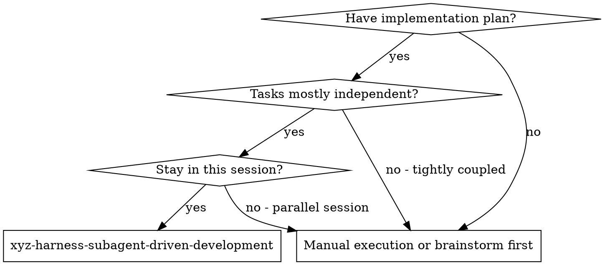
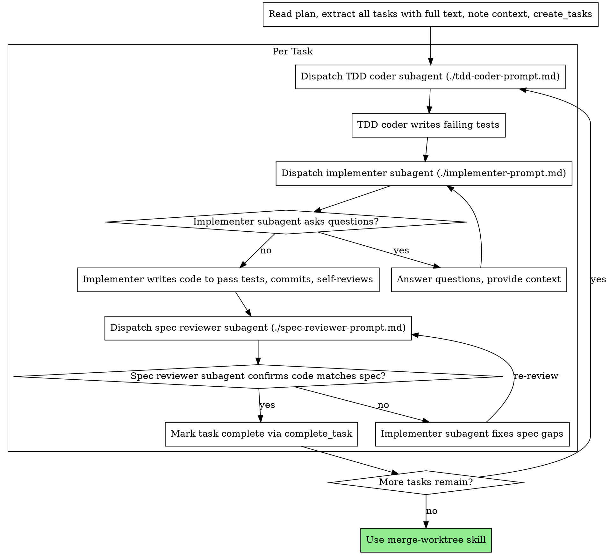

## Dev-flow 上下文

| 项目 | 值 |
|------|---|
| 所在阶段 | ③ 编码实现 |
| 触发方式 | 由 dev-flow 派遣执行 subagent 加载 |
| 上游 | ② 需求评审通过 + 用户确认 |
| 下游（完成后进入） | ③ 内部按 task 逐个执行编码 + spec 合规检查 → 完成后由 dev-flow 进入 ④ 编码评审 |
| 回退目标 | spec 合规不通过 → 当前 task 内修复；编码评审不通过 → 回退到 ③ 重新派遣 |

# Subagent-Driven Development

Execute plan by dispatching fresh subagent per task: TDD coder (writes failing tests) → implementer (writes code to pass tests) → spec compliance review.

**Why subagents:** You delegate tasks to specialized agents with isolated context. By precisely crafting their instructions and context, you ensure they stay focused and succeed at their task. They should never inherit your session's context or history — you construct exactly what they need. This also preserves your own context for coordination work.

**Core principle:** Fresh subagent per task: TDD coder (tests first) → executor (code to pass tests) → spec compliance review = high quality, fast iteration

**Continuous execution:** Do not pause to check in with your human partner between tasks. Execute all tasks from the plan without stopping. The only reasons to stop are: BLOCKED status you cannot resolve, ambiguity that genuinely prevents progress, or all tasks complete. "Should I continue?" prompts and progress summaries waste their time — they asked you to execute the plan, so execute it.

## When to Use



**vs. manual execution:**
- Same session (no context switch)
- Fresh subagent per task (no context pollution)
- TDD coder writes tests first, implementer writes code to pass them
- Spec compliance review after each task
- Faster iteration (no human-in-loop between tasks)

## The Process



## Model Selection

Use the least powerful model that can handle each role to conserve cost and increase speed.在 pi 环境中使用 `provider/model` 格式指定模型。

**Mechanical implementation tasks** (isolated functions, clear specs, 1-2 files): `llm-simple-router/glm-5-turbo`. Most implementation tasks are mechanical when the plan is well-specified.

**Integration and judgment tasks** (multi-file coordination, pattern matching, debugging): `llm-simple-router/glm-5.1`.

**Architecture, design, and review tasks**: `llm-simple-router/glm-5.1`.

**Task complexity signals:**
- Touches 1-2 files with a complete spec → `llm-simple-router/glm-5-turbo`
- Touches multiple files with integration concerns → `llm-simple-router/glm-5.1`
- Requires design judgment or broad codebase understanding → `llm-simple-router/glm-5.1`

## Handling TDD Coder Status

TDD coder subagents report one of three statuses. Handle each appropriately:

**DONE:** TDD coder wrote failing tests, all tests FAIL as expected → proceed to dispatch implementer subagent.

**NEEDS_CONTEXT:** TDD coder needs information that wasn't provided. Provide the missing context and re-dispatch.

**BLOCKED:** TDD coder cannot write tests. Assess the blocker:
1. If it's a context problem, provide more context and re-dispatch
2. If the spec is unclear, clarify with the human
3. If the task design is fundamentally flawed, escalate to the human

**Never** skip the TDD coder step. Tests-first is a hard requirement.

## Handling Implementer Status

Implementer subagents report one of four statuses. Handle each appropriately:

**DONE:** Proceed to spec compliance review.

**DONE_WITH_CONCERNS:** The implementer completed the work but flagged doubts. Read the concerns before proceeding. If the concerns are about correctness or scope, address them before review. If they're observations (e.g., "this file is getting large"), note them and proceed to review.

**NEEDS_CONTEXT:** The implementer needs information that wasn't provided. Provide the missing context and re-dispatch.

**BLOCKED:** The implementer cannot complete the task. Assess the blocker:
1. If it's a context problem, provide more context and re-dispatch with the same model
2. If the task requires more reasoning, re-dispatch with `llm-simple-router/glm-5.1`
3. If the task is too large, break it into smaller pieces
4. If the plan itself is wrong, escalate to the human

**Never** ignore an escalation or force the same model to retry without changes. If the implementer said it's stuck, something needs to change.

## Prompt Templates

- `./tdd-coder-prompt.md` - Dispatch TDD coder subagent (writes failing tests only)
- `./implementer-prompt.md` - Dispatch implementer subagent (writes code to pass tests)
- `./spec-reviewer-prompt.md` - Dispatch spec compliance reviewer subagent

## Example Workflow

```
You: I'm using Subagent-Driven Development to execute this plan.

[Read plan file once: .superpowers/${topic}/plan.md]
[Extract all 5 tasks with full text and context]
[Call create_tasks with all tasks]

Task 1: Hook installation script

[Get Task 1 text and context (already extracted)]
[Dispatch TDD coder subagent via pi subagent tool, agent: harness-tdd-coder]

TDD coder: [No questions, proceeds]
TDD coder:
  - Wrote failing tests for install-hook command
  - Tests cover: user-level install, --force flag, error cases
  - All 3 tests FAIL as expected
  - Committed test file

[Dispatch implementer subagent via pi subagent tool, agent: harness-executor]

Implementer: "Before I begin - should the hook be installed at user or system level?"

You: "User level (~/.config/superpowers/hooks/)"

Implementer: "Got it. Implementing now..."
[Later] Implementer:
  - Implemented install-hook command to pass all tests
  - All 3 tests now PASS
  - Self-review: All good
  - Committed

[Dispatch spec compliance reviewer]
Spec reviewer: ✅ Spec compliant - all requirements met, nothing extra

[Call complete_task for Task 1]

Task 2: Recovery modes

[Get Task 2 text and context (already extracted)]
[Dispatch TDD coder subagent, agent: harness-tdd-coder]

TDD coder: [No questions, proceeds]
TDD coder:
  - Wrote failing tests for verify/repair modes
  - Tests cover: mode switching, progress reporting, error handling
  - All 4 tests FAIL as expected
  - Committed test file

[Dispatch implementer subagent, agent: harness-executor]

Implementer: [No questions, proceeds]
Implementer:
  - Added verify/repair modes to pass all tests
  - 4/4 tests passing
  - Self-review: All good
  - Committed

[Dispatch spec compliance reviewer]
Spec reviewer: ❌ Issues:
  - Missing: Progress reporting (spec says "report every 100 items")
  - Extra: Added --json flag (not requested)

[Implementer fixes issues]
Implementer: Removed --json flag, added progress reporting

[Spec reviewer reviews again]
Spec reviewer: ✅ Spec compliant now

[Call complete_task for Task 2]

...

[After all tasks]
[All tasks complete, proceed to merge-worktree for integration]

Done!
```

## Advantages

**vs. Manual execution:**
- Subagents follow TDD naturally
- Fresh context per task (no confusion)
- Parallel-safe (subagents don't interfere)
- Subagent can ask questions (before AND during work)

**Efficiency gains:**
- No file reading overhead (controller provides full text)
- Controller curates exactly what context is needed
- Subagent gets complete information upfront
- Questions surfaced before work begins (not after)

**Quality gates:**
- Self-review catches issues before handoff
- Spec compliance review prevents over/under-building
- Review loops ensure fixes actually work
- Code quality review is handled separately by dev-flow 阶段④的 expert-reviewer skill

**Cost:**
- Three subagent invocations per task (TDD coder + implementer + reviewer)
- Controller does more prep work (extracting all tasks upfront)
- Review loops add iterations but only for spec compliance
- Catches issues early (cheaper than debugging later)

## Red Flags

**Never:**
- Start implementation on main/master branch without explicit user consent
- Skip spec compliance review
- Proceed with unfixed issues
- Dispatch multiple implementation subagents in parallel (conflicts)
- Make subagent read plan file (provide full text instead)
- Skip scene-setting context (subagent needs to understand where task fits)
- Ignore subagent questions (answer before letting them proceed)
- Accept "close enough" on spec compliance (spec reviewer found issues = not done)
- Skip review loops (reviewer found issues = implementer fixes = review again)
- Let implementer self-review replace actual spec review (both are needed)
- Move to next task while spec review has open issues

**If subagent asks questions:**
- Answer clearly and completely
- Provide additional context if needed
- Don't rush them into implementation

**If reviewer finds issues:**
- Implementer (same subagent) fixes them
- Reviewer reviews again
- Repeat until approved
- Don't skip the re-review

**If subagent fails task:**
- Dispatch fix subagent with specific instructions
- Don't try to fix manually (context pollution)

## Integration

**Required workflow skills:**
- **create-worktree** - Ensures isolated workspace (creates one or verifies existing)
- **xyz-harness-writing-plans** - Creates the plan this skill executes
- **merge-worktree** - Complete development after all tasks

**Subagents should use:**
- **TDD coder** uses harness-tdd-coder agent - writes failing tests only
- **Implementer** uses harness-executor agent - writes code to pass tests

**Code quality review:**
- Code quality review is handled by dev-flow 阶段④的 expert-reviewer skill，不在此流程中执行

<!-- LOCAL-OVERRIDE:START -->
## 本地目录覆盖规则

**以下规则覆盖本文档中所有关于输出目录的路径指定**（如 `docs/superpowers/specs/`、`docs/superpowers/plans/` 等）：

- **主目录：** `.superpowers/`（项目根目录下）
- **子目录命名：** `${yyyy-MM-dd}-${主题简短标题}`（例：`2026-04-14-core-proxy`）
- **路径映射：**
  - `docs/superpowers/specs/YYYY-MM-DD-<topic>-design.md` → `.superpowers/${主题}/spec.md`
  - `docs/superpowers/plans/YYYY-MM-DD-<feature>.md` → `.superpowers/${主题}/plan.md`
  - 其他文档按需拆分到 `.superpowers/${主题}/` 下
- **不同主题使用不同子目录，禁止混放**

**文档精简：** 单次写入超过 1000 字时优先拆分子文档，主文档保留概述和索引。使用 agent 并行编写各模块文档（并发度 ≤ 2），最后合成精简主文档。
<!-- LOCAL-OVERRIDE:END -->
